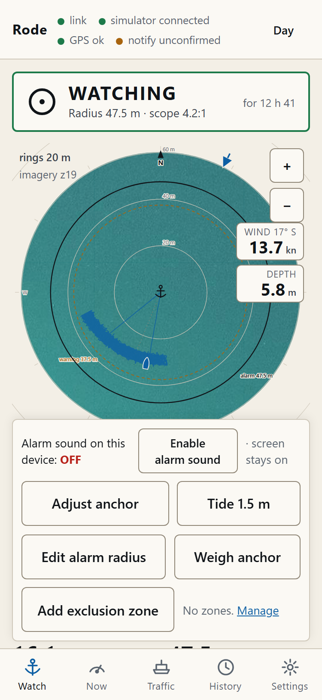
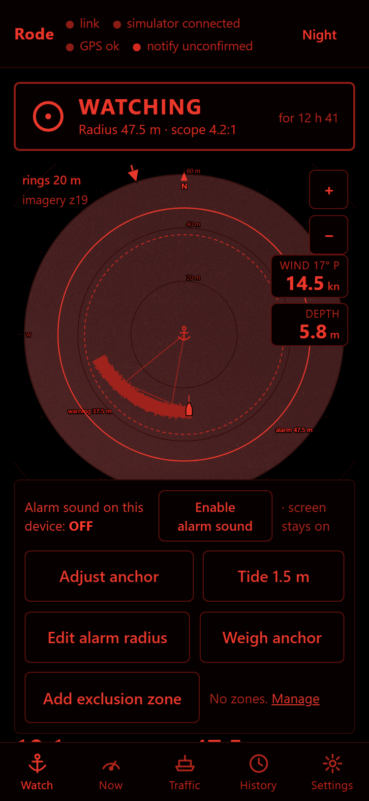
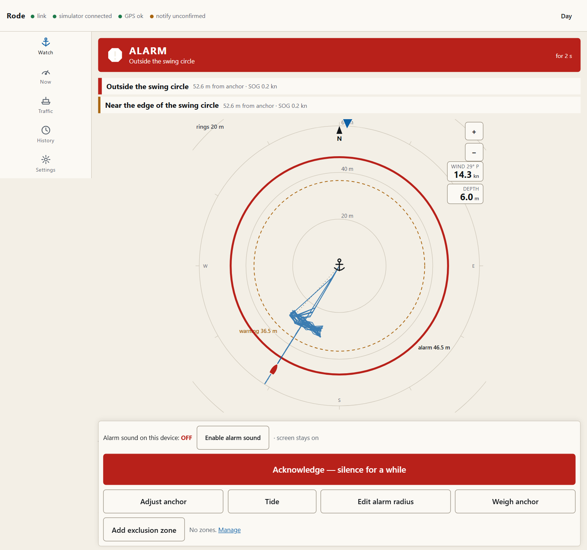
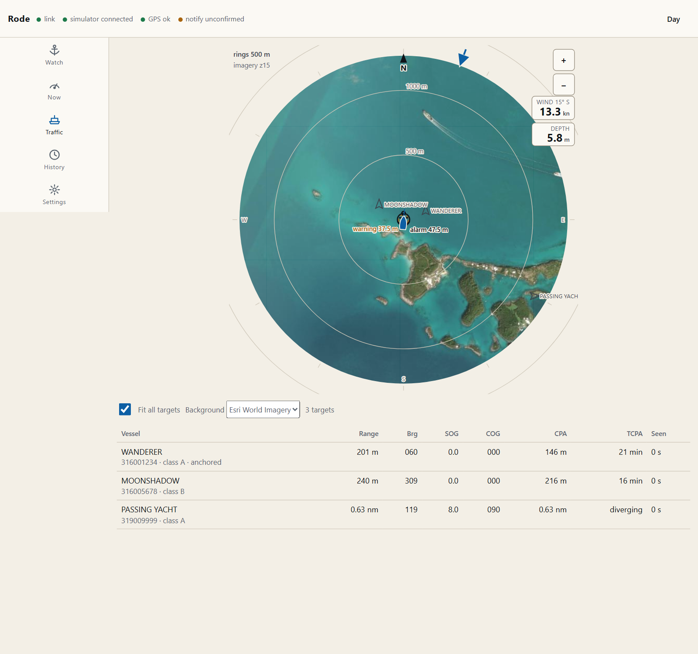
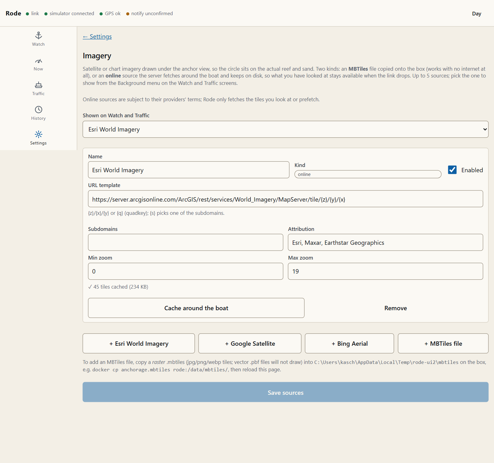

# Rode

Self-hosted anchor watch and boat monitor for vessels fitted with a Vesper
Marine **Cortex M1**. Runs on a Raspberry Pi 5 or small x86 box aboard,
ingests live NMEA 0183 from the Cortex over WiFi, and serves a mobile-first
web app you open from a phone: on board, from the dinghy, or from a bar
ashore over cellular.

Its headline feature is an anchor watch that **measures** the rode actually
paid out, computes real scope, warns before it alarms, and detects its own
failures.

> Rode does not replace a proper anchor watch or keeping a lookout.

<p align="center">
  
  &nbsp;&nbsp;
  
</p>

<p align="center">
  
</p>

<p align="center">
  
</p>

<sub>Screenshots are from the built-in simulator (a Bermuda anchorage), not a real boat. The imagery is real.</sub>

## What it does

- **Anchor watch.** Drop → back down → Set. The swing circle is computed
  from where the anchor went down and where the boat lay after backing
  down, corrected for the GPS antenna's offset from the bow roller, with the
  depth captured once at drop so the sounder can go off overnight. Three
  independent early-warning detectors (position near the edge, wind off the
  bow, sustained speed) with field-tested thresholds and hysteresis, a
  break-out rule that escalates straight to critical, and first-class
  alarms for GPS staleness and data-source loss.
- **Marina mode.** One tap when you leave the boat in a slip: tight radius,
  wind detector off, and it watches battery, solar yield and refrigeration
  instead, reporting every fridge/freezer band change including the one
  into "off", so a failed freezer that drifts to ambient cannot hide.
- **Exclusion zones.** Reefs, cables, fairways; checked independently of
  the circle, with projected-entry warnings from course and speed.
- **Notifications that prove themselves.** ntfy, Pushover, Telegram,
  webhook, MQTT, email. Every delivery is logged; every anchor set sends a
  confirmation so a dead channel shows up that evening, not weeks later; a
  daily heartbeat turns silence into a signal.
- **Self-monitoring.** Engine heartbeat supervisor, `/readyz` wired to
  Docker, unexpected-restart detection, diagnostics page.
- **Survives power loss.** SQLite in WAL mode; the anchor session and its
  geometry are rehydrated on boot within seconds.
- **Works with zero internet.** Everything runs on the boat's LAN. Remote
  access is via your own Tailscale/WireGuard; push and charts are additive.

## Hardware

|          |                                                                                                                                                                   |
| -------- | ----------------------------------------------------------------------------------------------------------------------------------------------------------------- |
| Computer | Raspberry Pi 5 (arm64) or an N100-class mini PC (amd64). 4–8 GB RAM, SSD or a good SD card. Idle load is well under 10 % of a Pi 5.                               |
| Data     | Vesper Cortex M1 hub on the boat's WiFi/LAN, emitting NMEA 0183 over TCP. Signal K is supported as an alternative source.                                         |
| Network  | The box, the Cortex and (optionally) a cellular router on one LAN. For remote access, Tailscale or WireGuard on the box; carrier CGNAT rules out port-forwarding. |
| Clock    | Pis have no RTC. Rode takes time from GPS sentences and reports "time not synced" until it has; nothing is logged as 1970.                                        |

### Finding the Cortex's IP and NMEA port

1. Open the **Cortex Onboard** app on a phone on the boat's WiFi.
2. Hub settings → Network: note the hub's IP address. Give it a DHCP
   reservation on your router so it does not change.
3. NMEA 0183 output over WiFi/TCP is on the hub; Vesper transponders have
   historically served it on **port 39150**. Verify on your unit: the
   Onboard app shows the port, or `nc <hub-ip> 39150` should print
   sentences.
4. If you instead feed a wired NMEA 0183 output from the Cortex into
   something else, remember that **AIS output over NMEA 0183 needs at least
   38400 baud**; 4800 will drop sentences.

Put the address and port in `.env` (`RODE_NMEA_HOST`, `RODE_NMEA_PORT`) or in
Settings › Data source.

## Install

Rode is one container plus optional profiles.

```bash
git clone https://github.com/clucraft/rode.git && cd rode
cp .env.example .env          # set RODE_NMEA_HOST at minimum
docker compose -f docker-compose.yml up -d
```

Open `http://<box-ip>:8080`. The first visit is the setup wizard: it creates
the admin account. There are no default credentials and nothing else is
served until that account exists.

Optional profiles:

```bash
docker compose --profile tiles up -d    # offline charts (docker/tiles/README.md)
docker compose --profile mqtt up -d     # MQTT broker for Home Assistant / a siren
docker compose --profile tls up -d      # Caddy TLS termination (docker/caddy/Caddyfile)
```

Images are published for `linux/amd64` and `linux/arm64` at
`ghcr.io/clucraft/rode` (`:latest` = last release, `:edge` = main).

## Boat geometry: measure it once

The GNSS antenna is rarely at the bow roller. On a 12 m boat it is often
8–10 m aft of it, and that puts several metres of false radius into every
swing circle unless it is corrected. Settings › Boat geometry:

- **Antenna to bow roller, forward** — stand under the antenna, measure to
  the roller along the centreline. Positive when the roller is forward.
- **Antenna to bow roller, to starboard** — the athwartships offset. Usually
  near zero; negative if the roller is to port.
- **Bow roller height above the waterline** — added to the depth for the
  rode triangle; scope is measured from the roller, not the surface.

Also worth setting: the sounder's transducer depth below the waterline
(Settings › Data source) so depths read from the surface.

## First night at anchor

1. Open **Watch**. Below "Suggested rode" is the length to pay out for your
   target scope at the current depth.
2. As the anchor touches bottom, press **Drop anchor**. Position and depth
   are recorded at that instant. If the sounder is off, you are asked for
   the depth.
3. Back down. When the anchor is holding, press **Anchor set**. Rode, scope
   and the swing circle are computed from what actually happened. Check the
   scope: skippers routinely believe they have more rode out than they do.
4. Tap **Enable alarm sound on this device**. iOS will not play audio
   without that tap; the screen tells you plainly whether sound is armed on
   _this_ phone.
5. If the anchor point looks off on the view, **Adjust anchor** lets you drag
   it; everything recomputes. Enter the expected **tide** range if it is
   large.
6. Every anchor set sends a notification: "Anchor watch active — radius 72
   m, rode 41 m, scope 5.7:1". If it does not arrive, fix that before you
   sleep. That is the point of it.
7. **Weigh anchor** asks for confirmation. One accidental tap cannot end a
   session. The old anchor stays on the view, greyed, until the next drop.

The view also shows the apparent wind as an arrow on the outer ring (where it
blows from, needs a heading), with wind speed and depth in the corner; both
radii are written on their rings and listed as readouts.

**Edit alarm radius** replaces the computed circle for the rest of the
session: drag either ring on the view or type the numbers. Unchecked, the
warning ring follows the alarm ring at the configured warn distance (either
field moves the other); tick _Ignore configured radius scale_ to set the two
independently. _Reset to computed_ goes back. Changing a threshold or the
boat geometry in Settings re-derives the circle of the session that is
running; you do not have to weigh and drop again.

**Add exclusion zone** opens the zone editor right there; drawing works on
top of the imagery, so a reef you can see is a reef you can fence.

The track slider, AIS toggle, background choice and the Traffic screen's
fit-all switch are stored on the boat, so a phone and a laptop always show
the same thing.

The banner shows one of: NOT WATCHING · ANCHOR DOWN · WATCHING · WARNING ·
ALARM. Acknowledging an alarm silences audio for the snooze period; it never
clears the condition, and it re-fires louder if still alarming.

## Imagery under the anchor view

Settings › **Imagery** takes up to five raster sources, picked from the
**Background** menu on Watch and Traffic:

- **MBTiles file** — copy a raster `.mbtiles` (jpg/png/webp tiles; vector
  `.pbf` will not draw) into the box's `/data/mbtiles` directory
  (`docker cp anchorage.mbtiles rode:/data/mbtiles/`, or the `rode-tiles`
  volume). Works with no internet at all. Make one from your own charts or
  satellite exports with e.g. QGIS, `gdal_translate -of MBTILES`, or
  SAS Planet.
- **Online** — Esri World Imagery, Google Satellite and Bing Aerial presets,
  or any `{z}/{x}/{y}` / `{q}` template. The _server_ fetches tiles as you
  look at them and keeps every one on disk under `/data/tile-cache`, so
  what you looked at with the cell link up is still there when it drops.
  **Cache around the boat** pulls 1.5 km at zoom 13–19 ahead of time (a
  few hundred tiles). Phones never talk to the provider. Provider terms
  apply to you, not to Rode; the Google and Bing endpoints are the
  unofficial tile servers.

<p align="center">
  
</p>

The polar view stays a north-up local plane; tiles are placed by projecting
their corners, which over an anchorage is exact to well under a pixel. At
night the imagery is red-shifted with the rest of the screen.

## Notifications

Settings › Notifications. Add a recipient, add channels, tick which
severities each channel gets, save, then **Test**: the result of every
target comes back on screen.

| Channel            | Setup                                                                                                                                                                                                                  |
| ------------------ | ---------------------------------------------------------------------------------------------------------------------------------------------------------------------------------------------------------------------- |
| **ntfy**           | Self-host or use ntfy.sh. Make a topic with an unguessable name, install the app, subscribe. Paste the full topic URL. On iOS, enable the app's critical-alert permission so critical alarms bypass Do Not Disturb.    |
| **Pushover**       | Create an application at pushover.net, paste the app token and your user key. Critical alarms use _emergency_ priority: they repeat until you acknowledge on the phone.                                                |
| **Telegram**       | Talk to @BotFather → `/newbot`, copy the token. Message the bot once, then get your chat id from `https://api.telegram.org/bot<token>/getUpdates`.                                                                     |
| **Webhook / MQTT** | For Home Assistant, a Zigbee siren or a relay: loud local noise when the phone is ashore and the boat is not. MQTT publishes retained `rode/alarm` (state name), `rode/alarm/active` (ON/OFF) and `rode/state` (JSON). |
| **Email**          | SMTP settings on the same page; used for the daily heartbeat.                                                                                                                                                          |

Environment variables (`RODE_NTFY_URL` etc.) form an extra recipient without
touching the UI. The status strip shows "notify ok N min ago" from the last
successful delivery anywhere, or "unconfirmed".

The **daily heartbeat** (Settings › Notifications) sends position, battery,
solar, fridge/freezer, GPS health, uptime and the last source reconnect
every morning at a local time you choose. If it stops arriving, something is
wrong: that is the signal.

## Remote access

Assume the boat is behind carrier CGNAT. Install Tailscale on the box (or
WireGuard to a VPS), then open `http://<box-tailnet-name>:8080` from
anywhere. Rode is built as if it were on the open internet (argon2id,
server-side sessions, CSRF, rate limits, optional TOTP) but do not expose it
without TLS: the `tls` profile runs Caddy, and `tailscale cert` gives you a
trusted certificate with no public DNS. Set `RODE_TLS=true` once TLS is on.

From a phone on a bad cell link, Settings › Units and display → **Low-
bandwidth mode** drops updates to every 5 s and suspends instrument and AIS
traffic; the alarm engine on the boat is unaffected.

## Backups

The database is one SQLite file. A consistent snapshot while running:

```bash
make backup            # → backups/rode-<timestamp>.db
```

or Settings › Diagnostics › Download backup from a phone. Restore with
`make restore FILE=backups/rode-....db` (stops the stack briefly). Nightly
housekeeping downsamples telemetry older than 48 h to 10 s and prunes past
`RODE_RETENTION_DAYS`; the event log is never pruned.

## Development

Node 22, pnpm. No Docker needed on the dev machine.

```bash
pnpm install
pnpm dev                     # server :8080 (tsx watch) + web :5173 (vite)
pnpm check                   # lint, format, typecheck, tests: what CI runs
make sim SCENARIO=slow-drag SPEED=60   # fake Cortex on tcp :39150
```

`RODE_SOURCE=simulator RODE_SIM_SCENARIO=break-out RODE_SIM_AUTO_COMMANDS=1`
runs the server against a scenario with the skipper's taps scripted. The ten
scenarios (`pnpm --filter @rode/ingest sim list`) are also the integration
tests: each replays through the real parser, normaliser and alarm engine and
asserts on the event log.

**Record the real boat**: `make record HOST=<hub-ip>` writes the raw stream
to `recordings/`. Replay it with `RODE_SOURCE=replay RODE_REPLAY_FILE=…` or
`rode-sim replay --file …`. Real recordings are the best test fixtures there
are; please contribute anonymised ones.

Layout:

```
apps/ingest     NMEA parser, normaliser, adapters (TCP/UDP/Signal K), simulator, record/replay
apps/server     Fastify API + WebSocket, alarm engine host, auth, notifications, SQLite
apps/web        React PWA
packages/core   Pure domain logic: geodesy, rode/scope math, state machine, detectors
packages/protocol  Shared zod schemas for the REST/WS contract
docs/decisions.md  Why things are the way they are
CHANGELOG.md       What changed, per release; edit the Unreleased section with your change
scripts/screenshots.mjs  Regenerates docs/screenshots from two simulator instances (pnpm screenshots)
```

Releases are git tags: `git tag v0.2.0 && git push --tags` publishes
`ghcr.io/clucraft/rode:0.2.0` and `:latest`; move the Unreleased entries in
CHANGELOG.md under the new version first.

## Troubleshooting

| Symptom                                     | Look at                                                                                                                                                                                              |
| ------------------------------------------- | ---------------------------------------------------------------------------------------------------------------------------------------------------------------------------------------------------- |
| "source disconnected" in the strip          | Settings › Diagnostics → Source. Is the hub IP/port right? `nc <ip> 39150` from the box. WiFi drop? The adapter reconnects with backoff forever; a half-open socket is killed after 15 s of silence. |
| GPS shown stale while the Cortex has a fix  | Diagnostics → sentence rates. If RMC/GGA arrive but position is stale, check the checksum error rate (bad WiFi) and whether RMC status is `A`.                                                       |
| Wind detector never fires / always fires    | Under 5 kn apparent it is suppressed by design. Check that MWV is apparent (`R`) not true, and that the vane is not reading garbage in light air.                                                    |
| Heading missing, antenna offset not applied | Rode needs HDT, or HDG/HDM plus variation (from RMC or Settings › Data source). Without heading it uses the antenna position and says so.                                                            |
| Login works then immediately logs out       | `RODE_TLS=true` on plain http → the browser drops the Secure cookie. Set it false, or put TLS on.                                                                                                    |
| No notifications                            | Settings › Notifications → Test. Read the per-target result. Then check the delivery log at the bottom of the page.                                                                                  |
| "restarted" pill in the strip               | The previous run did not shut down cleanly. Check `docker compose logs rode` and the event log for the boot event.                                                                                   |
| Container keeps restarting                  | `/readyz` fails when the engine has not ticked in 5 s. `docker compose logs rode` shows why.                                                                                                         |
| Alarm sound does not play on iPhone         | Tap **Enable alarm sound** after every reload; iOS requires the gesture. The strip says ON when it is actually armed.                                                                                |
| Clock wrong in the event log                | The Pi booted without internet and no GPS time yet. Diagnostics → Engine and time shows the GPS offset; the app displays times from the server clock.                                                |

## Security

See [SECURITY.md](SECURITY.md) for the threat model. Report issues privately
to the repository owner.

## Licence

MIT.
